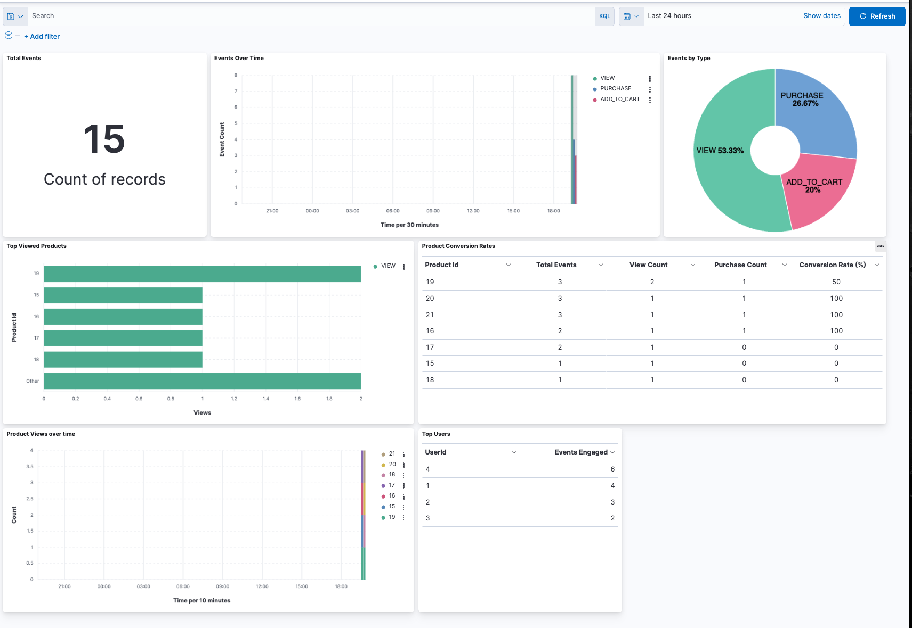
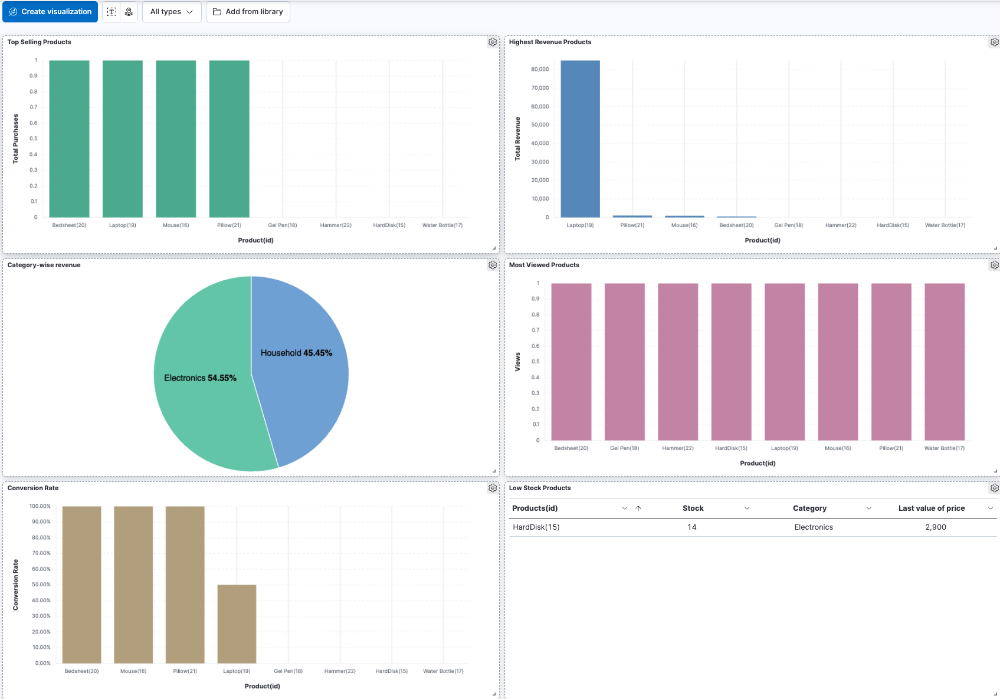

# E-commerce Backend

A Real-Time E-commerce Analytics & Recommendation Platform built with Spring Boot, MongoDB, Elasticsearch (local and Elastic Cloud), Redis, Kafka, and Logstash for comprehensive analytics and seamless data synchronization.

## 📊 Sample Dashboards

  

  

## Features

- **Order Management**: Track orders with detailed item information and status updates
- **Product Management**: Manage products with inventory tracking
- **Elasticsearch Integration**: Fast and powerful product search capabilities
- **Redis Caching**: Improved performance with strategic caching
- **Real-time Analytics**: Process user events in real-time using Kafka
- **Kibana Dashboards**: Visualize analytics data with pre-configured Kibana dashboards
- **Logstash Integration**: Sync data to Elastic Cloud reliably using Logstash
- **Real-time Sync**: Keep local and cloud Elasticsearch indices synchronized in real-time
- **Index Template Setup and Runtime Fields**: Advanced Elasticsearch configurations for optimized analytics

## Architecture

The application follows a dual-write architecture:
- Data is stored in MongoDB for persistence
- Data is indexed in Elasticsearch for search and analytics
- Redis is used for caching frequently accessed data
- Kafka is used for asynchronous processing of user events
- Logstash is used for ingesting data into Elastic Cloud for centralized analytics
- Dual sync strategy: local Elasticsearch enables fast local testing and development, while Elastic Cloud provides centralized, scalable analytics

## Getting Started

### Prerequisites

- Java 11+
- Maven
- MongoDB
- Elasticsearch 7.x (local)
- Redis
- Kafka
- Kibana (for analytics dashboards)
- Logstash (for syncing data to Elastic Cloud)

### Running the Application

1. Clone the repository  
2. Configure application properties in `src/main/resources/application.properties`, including endpoints for both local and/or Elastic Cloud Elasticsearch instances  
3. Configure Logstash to point to the appropriate Elasticsearch endpoints (local and/or cloud)  
4. Build the application: `mvn clean install`  
5. Run the application: `mvn spring-boot:run`

## API Endpoints

### Order Management

- `GET /api/orders` - Get all orders
- `GET /api/orders/{id}` - Get order by ID
- `POST /api/orders` - Create a new order
- `PUT /api/orders/{id}` - Update an order
- `DELETE /api/orders/{id}` - Delete an order

### Product Management

- `GET /api/products` - Get all products
- `GET /api/products/{id}` - Get product by ID
- `POST /api/products` - Create a new product
- `PUT /api/products/{id}` - Update a product
- `DELETE /api/products/{id}` - Delete a product

### Product Search

- `GET /api/product-search` - Search products with various filters
- `GET /api/product-search/autocomplete` - Autocomplete product names

### Analytics

- `GET /api/analytics/summary` - Get event summary
- `GET /api/analytics/top-viewed-products` - Get top viewed products
- `GET /api/analytics/top-purchased-products` - Get top purchased products
- `GET /api/analytics/trending-products` - Get trending products
- `GET /api/analytics/product-conversion-rates` - Get product conversion rates

### Real-time Analytics

- `GET /api/real-time-analytics/event-counts` - Get real-time event counts
- `GET /api/real-time-analytics/top-viewed-products` - Get real-time top viewed products
- `GET /api/real-time-analytics/top-purchased-products` - Get real-time top purchased products
- `GET /api/real-time-analytics/conversion-rate/{productId}` - Get real-time conversion rate for a product

## Analytics with Kibana

This project includes pre-configured Kibana dashboards for visualizing analytics data. It supports both local Elasticsearch/Kibana setups as well as Elastic Cloud environments.

To set up the dashboards:

1. Ensure Elasticsearch and Kibana (local or Elastic Cloud) are running  
2. For local setup, follow the instructions in [docs/KibanaDashboardSetup.md](docs/KibanaDashboardSetup.md)  
3. For Elastic Cloud, use the Elastic Cloud console to import dashboards or use the [docs/kibana-dashboards-export.ndjson](docs/kibana-dashboards-export.ndjson) file via Kibana’s import feature  
4. Dashboards provide visualizations for:  
   - Event overview (counts by type, trends over time)  
   - Product analytics (top viewed/purchased products, conversion rates)  
   - Category analytics (top categories, trends)  

## Architecture Decisions

### Dual-Write Architecture

We use a dual-write architecture to get the best of both worlds:
- MongoDB for reliable persistence and complex data relationships
- Elasticsearch for fast search and powerful analytics

### Event-Driven Processing

User events (views, clicks, purchases) are processed asynchronously using Kafka:
1. Events are published to Kafka topics
2. Consumers process these events in real-time
3. Events are stored in Elasticsearch for analytics
4. In-memory counters provide immediate real-time analytics

### Caching Strategy

Redis is used for caching with different TTL (Time-To-Live) values based on data volatility:
- Product data: Longer TTL as it changes less frequently
- Analytics data: Shorter TTL as it's constantly updated

### Logstash and Dual Sync Strategy

Logstash is used to ingest data from local Elasticsearch instances to Elastic Cloud, ensuring centralized analytics and backup. This dual sync approach allows:
- Fast local testing and development using local Elasticsearch
- Centralized, scalable analytics and visualization on Elastic Cloud

## Future Enhancements

- Recommendation engine based on user behavior
- Time-series analysis for demand forecasting
- AI agent for dynamic decision making
- UI for managing dashboards and analytics settings
- Cloud-native deployment with Docker and Podman
